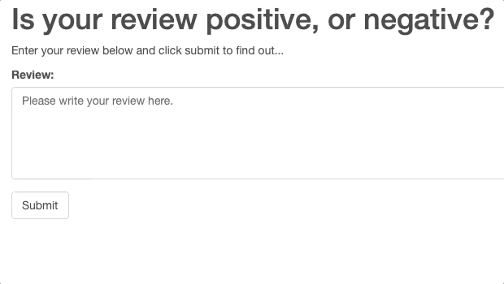

# SageMaker Sentiment Analysis Web Application

The notebook and Python files provided here, once completed, result in a simple web app which interacts with a deployed recurrent neural network performing sentiment analysis on movie reviews.

Output examples:

